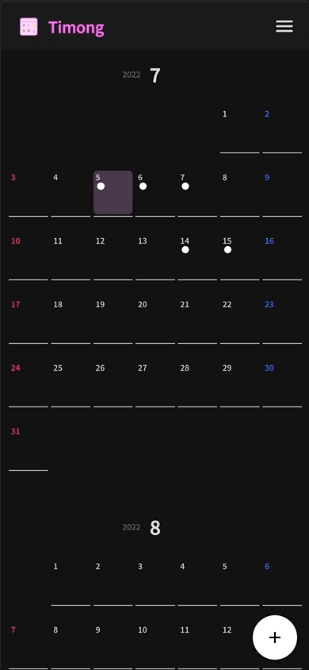
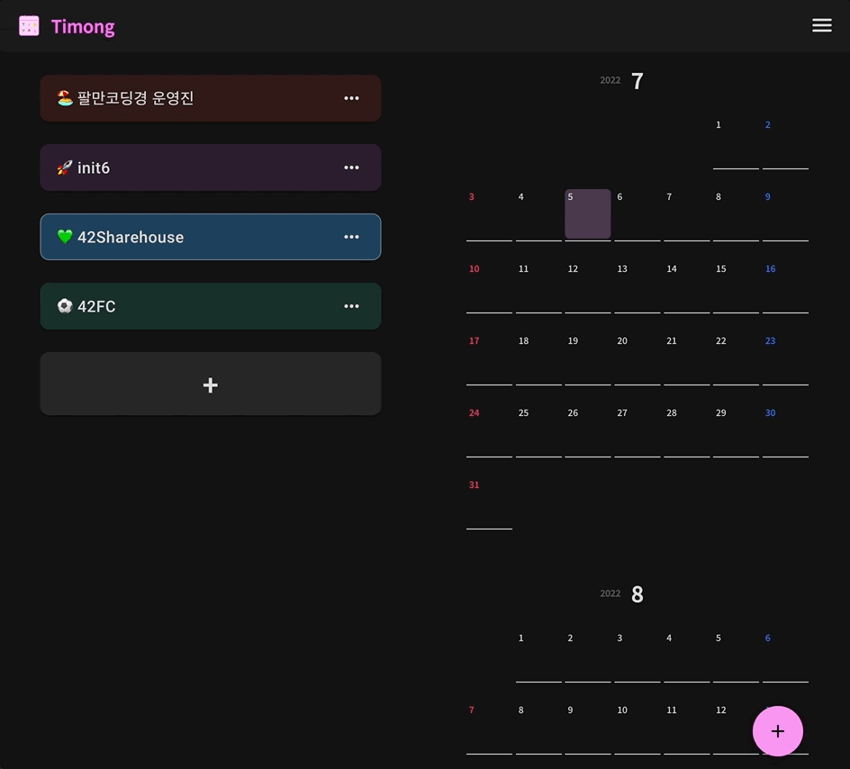
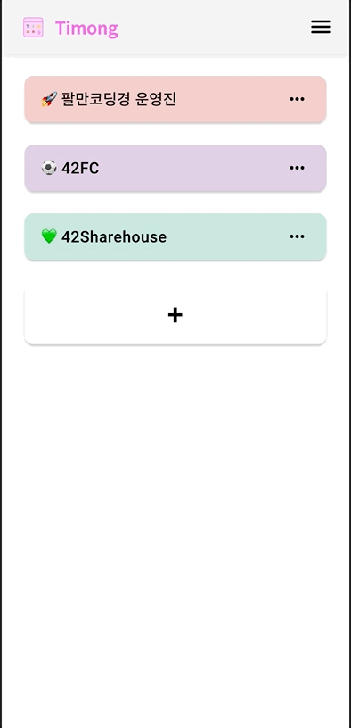
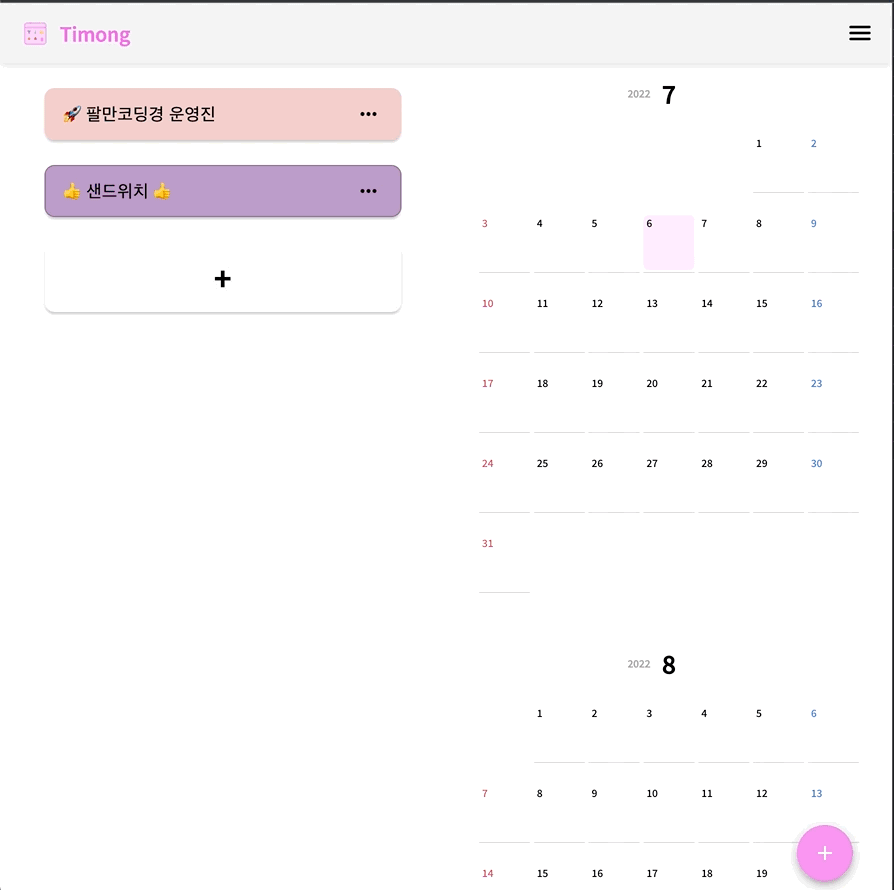
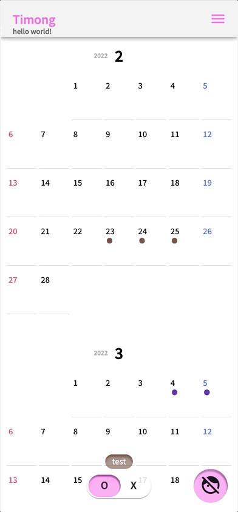
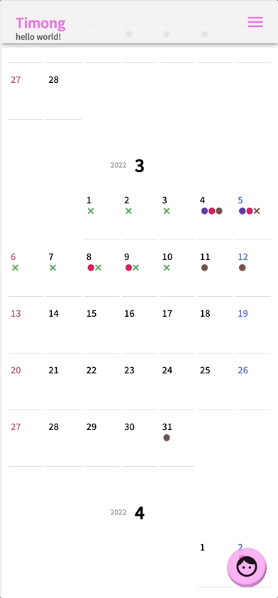
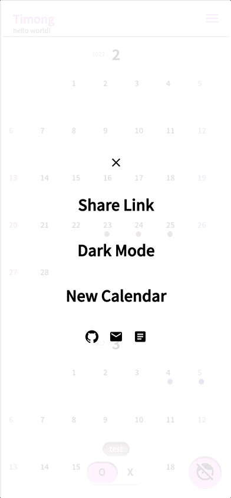

# [Timong!](https://timong.kr)

**Timong**으로 친구들과의 모임 일정을 정해보세요💕

 

> ”나는 수목금 빼고 다 돼~!”

> ”이번주는 금토 가능!!”

 

자꾸 헷갈리게 되는 메세지는 더 이상 ❌

**Timong** 으로 가능한 날과 불가능한 날을 직관적으로 표시하세요 😀

 

> [샘플달력을 사용해보세요!](https://timong.kr/62cf9111190bfec5c75a09dd)

 
 

### 어두운 테마

|                                         |                                     |     |
| --------------------------------------- | ----------------------------------- | --- |
|  |  |

### 밝은 테마

|                                              |                                          |     |
| -------------------------------------------- | ---------------------------------------- | --- |
|  |  |

 
 

# 사용 방법

링크만 있으면 간단하게 친구들과 약속일정을 잡을 수 있어요!
되는 날은 🙆🏻‍♂️  안되는 날은 🙅🏻‍♀️ 자유롭게 친구들과 표시하는 규칙을 정해보세요!

달력은 원하는 만큼 생성할 수 있어요!
스터디 가능인원 체크, 친구들과 회식 일정잡기 등 이제 **달력 캡쳐**는 그만..!

**Timong**이 해결해 드릴게요!

## 1. 달력 생성

- [링크](https://timong.kr)로 이동해서 원하는 **캘린더 제목**을 입력하세요!
- 입력한 제목은 생성한 캘린더의 고유 이름으로 지정되며 항상 캘린더 상단에 표시돼요🙂

 

## 2. 유저 버튼

- **사용 중인 유저 보기**

  오른쪽 하단의 버튼을 눌러서 사용자를 추가해주세요!

- **유저 추가**

  다이얼의 + 버튼을 눌러 유저를 추가할 수 있어요!

- **유저 삭제**

  유저를 왼쪽으로 스와이프해서 원하는 유저를 삭제해 보세요!

 

## 3. 달력 공유

이제 생성한 달력을 공유해 보아요! 링크를 가지고 있는 친구들은 여러분이 생성한 달력을 실시간으로 볼 수 있어요 🙂

- 오른쪽 상단의 메뉴 → Share Link 클릭!
- 혹은 주소창에서 링크 복사를 통해서도 가능해요!

 

## 4. 날짜별 유저 정보 보기

특정 날짜를 클릭해서 해당 날짜에 스케쥴을 등록한 유저 목록을 볼 수 있어요!
색깔만으로 구별이 어렵다면 상세 정보를 확인하세요!

 

## 5. 추가 기능

### 테마

현재 **Timong**은 라이트 모드와 다크 모드를 제공하고 있어요!
원하는 테마를 사용해보세요 🎃

→ 추후 테마 정보를 저장할 수 있는 기능을 추가할 예정입니다!

### 새 달력

New Calendar 버튼을 통해 새 달력을 만들어서 공유할 수 있어요!

 
 

# 프로젝트 소개

42서울을 진행하면서 스터디 연말 회식일정을 잡다가 10명이 넘는 사람들의 일정 맞추는게 너무 어려웠습니다. 단톡방에서 투표를 매번 올려서 정하고 투표를 만들 때에도 최대한 많은 날을 만들었어야 했습니다. 뭔가 일정을 가볍게 공유할 수 있는 달력이 있으면 좋겠다고 생각해서 Timong을 만들게 되었습니다.

 

| 팀원             | 역할                         | github                                    |
| ---------------- | ---------------------------- | ----------------------------------------- |
| suhshin (신수형) | `frontend` `design` `schema` | [🔗 link](https://github.com/rkskekzzz)   |
| ycha (차영훈)    | `backend` `schema`           | [🔗 link](https://github.com/skyrich2000) |
| kilee (이기훈)   | `backend` `deploy`           | [🔗 link](https://github.com/likilee)     |

 

### 이슈 및 풀리퀘스트

이슈 및 풀리퀘스트는 언제나 환영 :) 정해진 컨벤션은 없습니다!

 

**버그제보 및 추가기능 요구는 이슈로!**

 
 

# Timong을 만들면서 배운 것은?

## **Frontend** by suhshin

이전 프로젝트와 다르게 디테일 및 완성도에 집중했습니다. 클라이언트를 고려하여 최적화된 랜더링과 직관적인 인터렉션을 설계하려고 노력했습니다.

### 다양한 React 라이브러리에 익숙해지기

또한 기존에 사용해보았던 라이브러리에 더해 더욱 더 다양한 라이브러리를 사용해보고 제 프로젝트에 맞게 활용하였습니다. 무한 스크롤 기능을 고민하면서 어떤 방식을 사용해볼지 고민하다가, 많은 서비스들이 적용하고 있는 react-virtualized 라이브러리를 사용해 보았습니다. 구조상 유저가 바뀌면 달력이 전부 새로 연산하게 되는 상황에서 최적화된 랜더링을 사용할 수 있었습니다.

- react-virtualized
- lodash
- axios
- moment
- styled-component
- mui

### React hook 연습

이전 프로젝트에서 hook에 대한 이해도 없이 개발했던게 아쉬워서 최대한 다양한 React hook들을 써보며 실제로 적용해 보았습니다. 특히, jaeskim님과 코드리뷰를 통해 useCallback과 useMemo의 차이에 대한 이해도를 높였습니다.

특히 에니매이션 적용시 자주 사용했던 setTimeout의 경우 useEffect에서 cleanup code를 함께 작성해 주어야 한다는 것을 배웠습니다.

- useCallback
- useMemo
- React.memo
- useEffect cleanup code
- useReducer
- context API

### 빌드 분석

많은 라이브러리를 사용하다보니 빌드 파일이 커지고 빌드 시간이 오래걸렸습니다. webpack-bundle-analyzer를 활용해서 현재 가장 용량을 많이 차지하는 bundle을 분석하고 구조 분해 할당으로 가져오던 모듈을 경로를 지정하여 가져오면서 불필요한 bundle 사이즈를 줄였습니다.

이번 프로젝트에 적용했던 것들을 토대로 다음 프로젝트에서는 최적화까지 적용해보려고 합니다.

- webpack-bundle-analyzer 활용

### css, eventListener 기술 향상시키기

위에서도 언급했듯이 이번 프로젝트에서는 사용자 경험을 중요시 여겼습니다. 다양한 시각적인 인터렉션을 구현하고 라이트/다크 테마 적용 등 디자인 적인 부분에 많은 시간을 투자하였습니다.

특히 데스크탑 환경과 모바일 환경, chrome과 safari등 다양한 브라우저를 모두 테스트 해보며 브라우저별 특징을 익혔습니다.

- transition 학습 및 적용
- animation, keyframe 학습 및 적용
- cross-plaform webpack 적용

### 광고 적용 및 분석도구 등록

- google analytics 연결
- google addsense 연결

### ssl 인증서 적용하기

유저의 개인정보를 db에 저장하고 있진 않지만, 암호화 통신을 하지 않으면 너무 적나라하게 모든 내용이 들어날 수 있기 때문에 암호화 통신을 적용하기로 했습니다. 기존에 배포했던 프로젝트들은 zeroSSL을 사용해서 3개월 무료 인증서를 발급 받아 사용하였습니다. 하지만 3개월이 지나면 재발급을 수동으로 해주어야 하는 것들이 너무 불편했습니다.

이번 프로젝트에서는 Letsencrypt를 활용해서 12시간마다 인증서를 갱신해주는 스크립트를 사용했습니다. Letsencrypte를 사용하면 multidomain까지 무료로 사용할 수 있어서 적합하다고 생각했습니다.

### Private Routes

###

## **Backend** by ycha

### 몽고 DB 사용

지금까지 RDB만 사용했었는데, Nosql을 처음 사용해보았습니다.

nested object를 처리하는게 익숙하지 않아서 조금 까다로웠습니다.

## **Deploy** by kilee

AWS 라이트 세일을 사용하여 배포해보았습니다.

[보러가기]](https://www.craft.do/s/t71WkFolHXjYXS)
